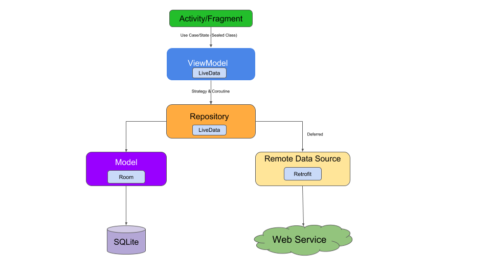

Prototype Android Project
===================================

### Projects

### Architecture Components : MVVM

* **[Android Architecture Components](https://developer.android.com/topic/libraries/architecture/)** - Android architecture components are a collection of libraries that help you design robust, testable, and maintainable apps. Start with classes for managing your UI component lifecycle and handling data persistence..

### Other Sources

- [Kotlin](https://developer.android.com/kotlin/)
- [Room](https://developer.android.com/topic/libraries/architecture/room)
- [Lifecycle-aware components](https://developer.android.com/topic/libraries/architecture/lifecycle)
- [ViewModels](https://developer.android.com/topic/libraries/architecture/viewmodel)
- [LiveData](https://developer.android.com/topic/libraries/architecture/livedata)
- [Navigation](https://developer.android.com/topic/libraries/architecture/navigation/)

License
-------

By anoulong@gmail.com# trowitter
